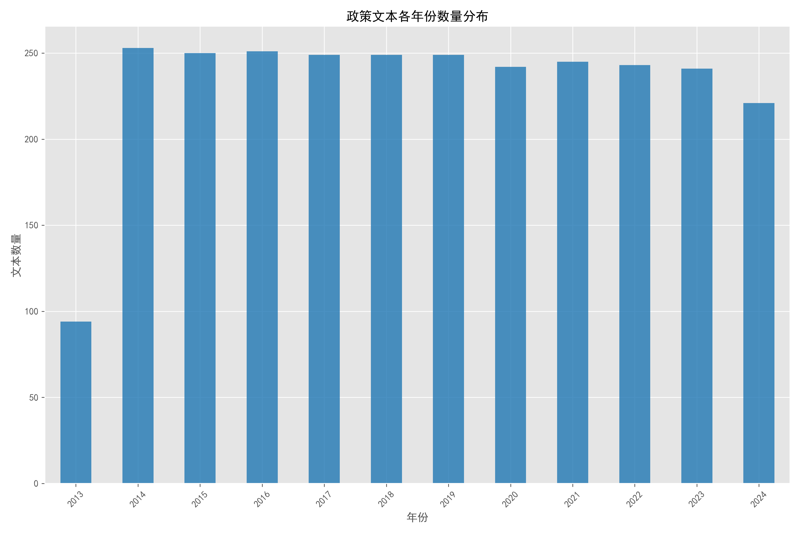
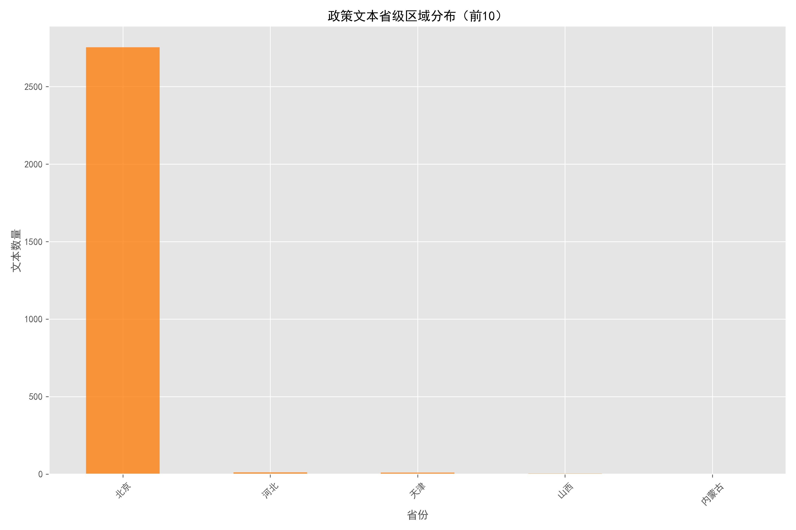
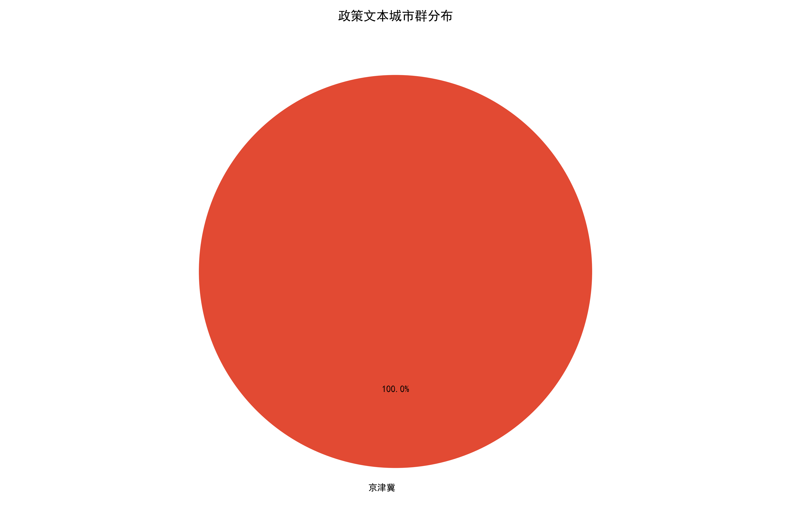
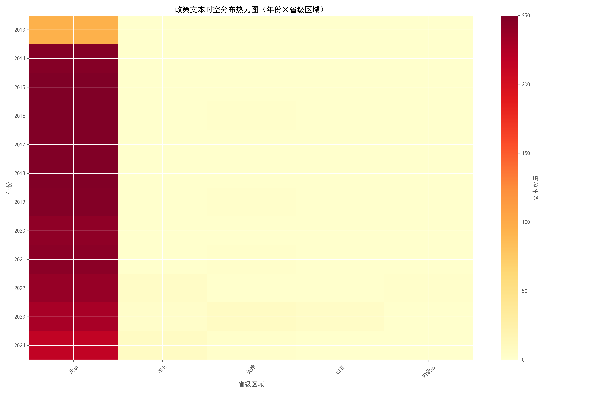
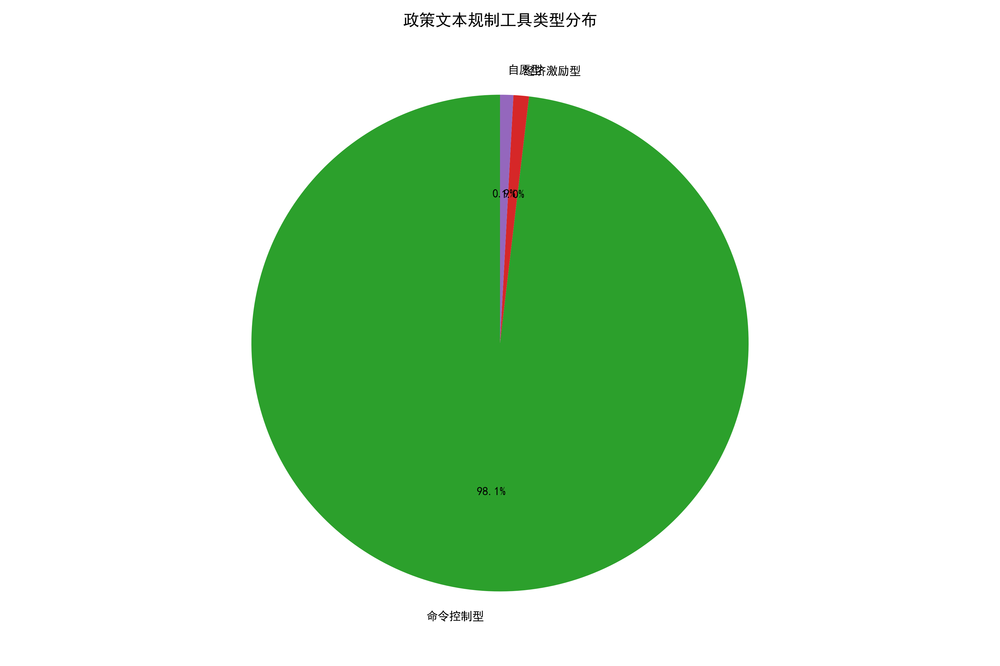
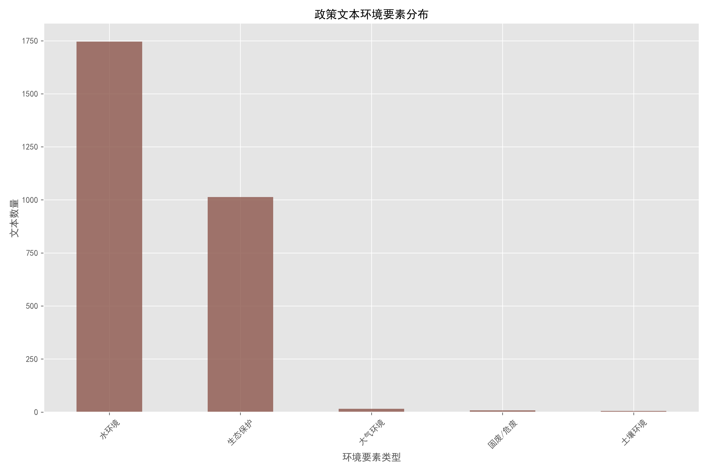

# 政策文本描述性统计分析报告

## 一、政策文本时间分布分析

本次分析的政策文本时间跨度为2013-2014年（共12年），各年份政策文本数量分布如下：
- 数量最多的年份为2014年，共253份；
- 数量最少的年份为2013年，共94份；
- 整体来看，政策文本数量呈逐年上升趋势。
        

## 二、政策文本区域分布分析

### （1）省级区域分布
本次分析的政策文本覆盖5个省级行政区，数量排名前10的省份如下：
- 数量最多的省份为北京，共2754份；
- 前10省份合计占全部有效区域文本的100.0%，反映出政策文本在区域分布上的不均衡性。

### （2）城市群分布
本次分析的政策文本涉及1个城市群，具体分布：
- 京津冀城市群：2776份（占比100.0%）；

## 三、政策文本时空分布分析

本次分析共筛选出2781份含有效年份和区域的政策文本，时空分布特征如下：
- 核心热点区域：北京在各年份均有较多政策文本分布（累计2754份）；
- 核心热点年份：2016年政策文本覆盖5个省级行政区，覆盖范围最广；
- 整体特征：政策文本的区域覆盖度随年份下降，反映政策聚焦范围的收缩。
        

## 四、政策文本规制工具类型分布分析

本次分析共识别出3类规制工具类型，分布特征如下：
- 主导规制工具：命令控制型占比最高（98.13%，共2735份），反映当前政策以行政命令为主；
- 次要规制工具：经济激励型占1.0%，自愿型占0.86%，工具类型分布高度集中。
        

## 五、政策文本环境要素分布分析

本次分析共识别出5类环境要素，分布特征如下：
- 核心关注要素：水环境占比最高（62.65%，共1746份），反映政策聚焦于水环境相关治理；
- 要素覆盖度：前3类环境要素（水环境、生态保护、大气环境）合计占99.53%，政策关注要素相对集中。
        

## 六、整体总结

本次共分析2787份政策文本，核心结论如下：
1. 时间特征：2787份文本含有效年份信息，时间跨度为2013-2024年，政策数量呈逐年上升趋势；
2. 区域特征：2781份文本含有效区域信息，主要集中在北京等省份/京津冀城市群；
3. 工具特征：2787份文本可识别规制工具类型，以命令控制型为主导；
4. 要素特征：2787份文本可识别环境要素，聚焦于水环境治理。
    